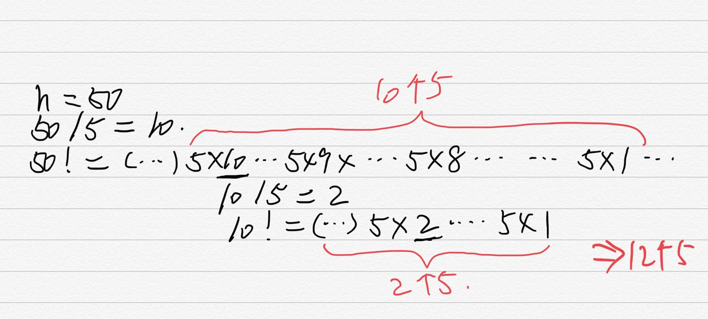

# 阶乘后的零

## 题目

给定一个整数 n，返回 n! 结果尾数中零的数量。

示例 1:

输入: 3

输出: 0

解释: 3! = 6, 尾数中没有零。

示例 2:

输入: 5

输出: 1

解释: 5! = 120, 尾数中有 1 个零.

说明: 你算法的时间复杂度应为 O(log n) 。

来源：力扣（LeetCode）
链接：https://leetcode-cn.com/problems/factorial-trailing-zeroes

---

## 题解

```bash
5! = 5*4*3*2*1 = 5*2*2*3*2*1 ====> 1个0
     - -   -
10! = 10*9*8*7*6*5*4*3*2*1 = 2*5*...5*...*2*1 ===> 2个0
      --         -     -       -    -
```

- 通过观察我们可以发现如果阶乘过程中出现了2*5那就会生成一个0，而2的个数永远大于等于5的个数，所以我们只需要计算阶乘过程中5出现的个数即可.

```bash
n! = x * (2 * 5) ^ k
   = x * (2^k * 5^k)
```

- 计算方法如下例所示：



- 解释：
- 50/5=10表示50的阶乘里首先存在10 * 5 至 1 * 5 运算里的10个5，这是第一层
- 然后因数是10到1，10/5=2，10可以被分为5 * 2，是5的倍数，而我们可以看到比10小的并且是5的倍数的还有5，也就是1 * 5，所以在10到1这十个因数里还有10和5能够分解出5来这是第二层计算，接下来我们看到分解10!里的因数取的是2，1，并不能再分解出5来了，计算结束。
- 所以总共10+2=12个，意味着阶乘后又=有12个0.

```javascript
/**
 * @param {number} n
 * @return {number}
 */
var trailingZeroes = function(n) {
    var zeros = 0;
    while(n>=5) {
      // 累计本层的5
        zeros += parseInt(n/5);
      // 进入下一层
        n = parseInt(n/5);
    }
    return zeros;
};
```
