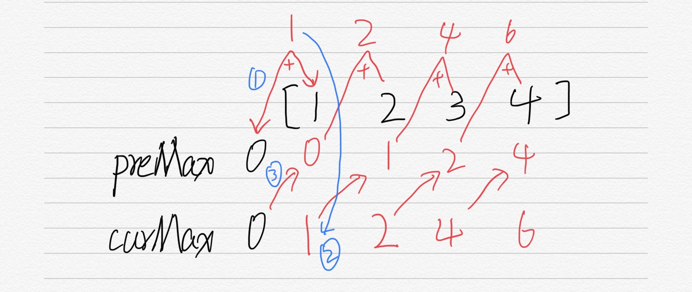

# 打家劫舍

## 题目

你是一个专业的小偷，计划偷窃沿街的房屋。每间房内都藏有一定的现金，影响你偷窃的唯一制约因素就是相邻的房屋装有相互连通的防盗系统，如果两间相邻的房屋在同一晚上被小偷闯入，系统会自动报警。

给定一个代表每个房屋存放金额的非负整数数组，计算你在不触动警报装置的情况下，能够偷窃到的最高金额。

示例 1:

输入: [1,2,3,1]

输出: 4

解释: 偷窃 1 号房屋 (金额 = 1) ，然后偷窃 3 号房屋 (金额 = 3)。

     偷窃到的最高金额 = 1 + 3 = 4 。

示例 2:

输入: [2,7,9,3,1]

输出: 12

解释: 偷窃 1 号房屋 (金额 = 2), 偷窃 3 号房屋 (金额 = 9)，接着偷窃 5 号房屋 (金额 = 1)。

     偷窃到的最高金额 = 2 + 9 + 1 = 12 。

来源：力扣（LeetCode）
链接：https://leetcode-cn.com/problems/house-robber

---

## 题解

- 动态规划解法：每次的进一步以上一次的结果为基础
- n = 1时，很明显只打劫这一家金额最高
- n = 2时，应打劫两家当中最大的一家
- n = 3时，有两种情况：1.你打劫了第二家，所以不打劫第三家；2.打劫了第一家，再打劫第三家——选择肯定是选择金额大的。
- 所以打劫时候出现的两种选择说白了就是：打劫中间的一个屋子钱多还是打劫两边的两个屋子钱多的问题。
- 假设最终所得金额为f(k)，打劫前k家，第k家能够得到金额为Ak，有公式：f(k) = max(f(k-2) + Ak, f(k-1))



```javascript
/**
 * @param {number[]} nums
 * @return {number}
 */
var rob = function(nums) {
    // 结算上一次最大
    var preMax = 0;
    // 结算当前最大
    var curMax = 0;
    for(let i = 0; i < nums.length; i ++) {
        // 记下当前最大值
        var temp = curMax;
        // 更新当前最大值（此时temp记下的变成最近的上一次）
        curMax = Math.max(preMax + nums[i], curMax);
        // 更新上一次的最大值
        preMax = temp;
    }
    return curMax;
};
```

