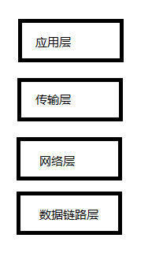
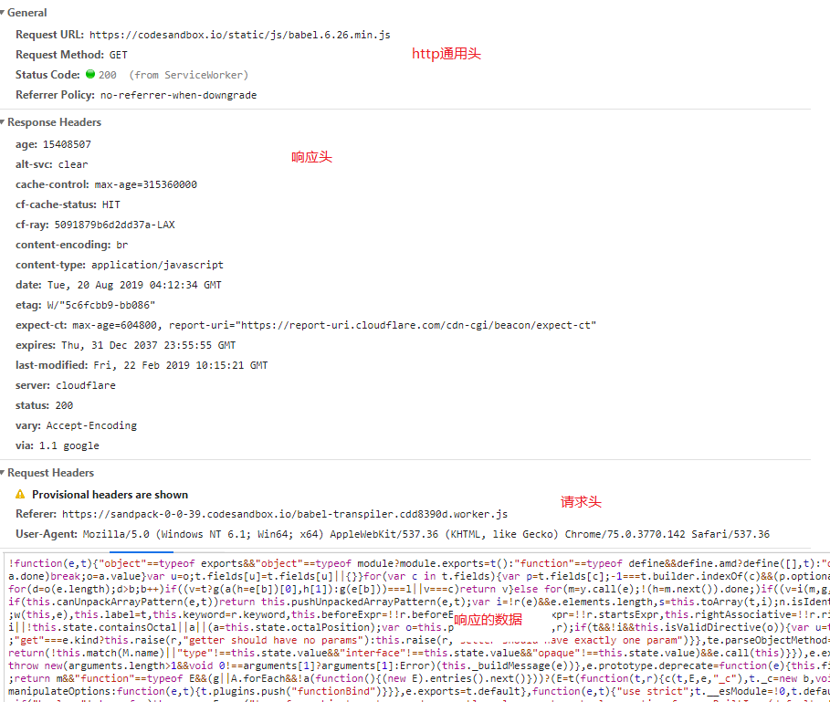
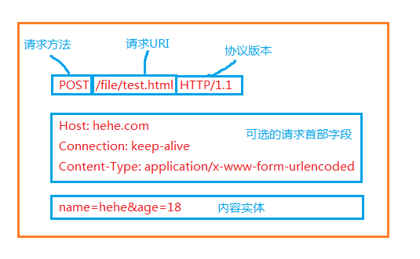
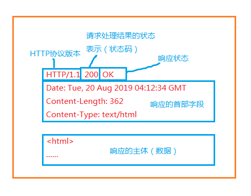
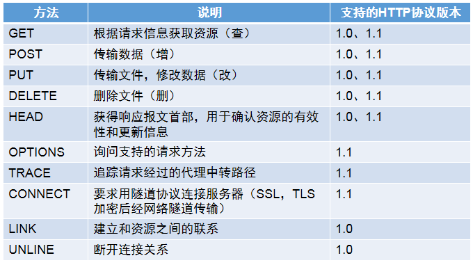
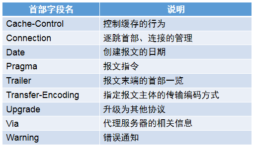
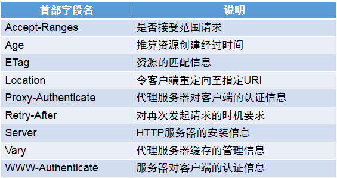
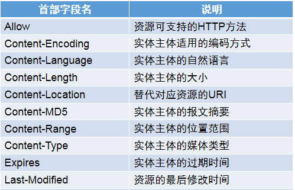
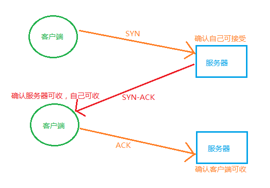
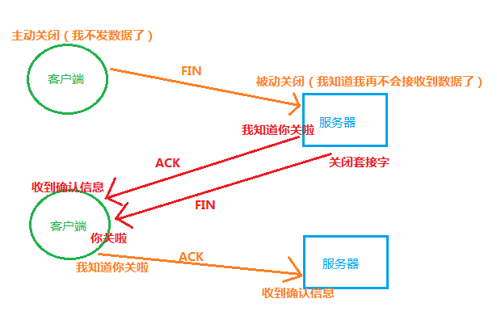

# http

- 参考资料：《图解http》

## 访问web

- 浏览器地址栏输入URL -> 客户端向浏览器发起请求 -> 服务器响应
- http（超文本传输协议）的地位：是客户端和服务器通信的协议规范（之一）

## TCP/IP协议簇

### 名词简介

- 协议：计算机与其他网络设备互相通信时约定的传达信息的通信规则（规范）。可以类比我们的语法，我们约定主谓宾结构来表达某人干某事的含义，说一句话就可以按主谓宾的结构来解析这句话，从而获得要表达的意思。

- 需要明确的一点是，计算机与网络设备通信时涉及到需要规范的点有很多：比如如何寻找到通信的对方，使用何种一致的语言规则来表达含义，通信结束的信号是什么样，硬件、操作系统之间怎样通信等等

- TCP/IP协议簇：是Internet的基础，也是当今最流行的组网形式。TCP/IP是一组协议的代名词，包括许多别的协议，组成了TCP/IP协议簇。
- 协议簇里的各种协议就是针对上面提到的各种问题作出了规范，为了清晰有条理且方便地管理各种协议，我们将整个通信过程中涉及到的问题（和对应的协议）做了分层（分类）—— 就是常提到的分层协议模型。
- 分层模型有各种各样的，这里我们只探讨TCP/IP里的分层模型，如下：

### 通信传输流

- 整个客户端和服务端通信（传递数据）时的流程如下，这里拿客户端向服务器发送请求的方向为例（服务器向客户端传递数据则是反方向）：

- 那http协议属于哪层上的协议呢？显而易见，我们前后端收发数据就是利用了http协议，http协议与我们的应用紧密相关，那就是在应用层了。

- 整个通信流用文字来描述就是：
  1. 应用层：客户端按照http协议规范将数据包装成一个查看某web页面的http请求并发出，传给下一层
  2. 传输层：传输层按照TCP协议把上面来的http请求报文分割成几段，并在各个小报文上打上标记便于区分辨认（增加TCP首部），传给下一层
  3. 网络层：在报文上按照IP协议增加通信目标的MAC地址（增加IP首部），传给下一层
  4. 数据链路层：按照硬件部分的信号传递规则传输给服务器的数据链路层（增加以太网首部）

  5. 数据链路层：服务器端数据链路层接收到数据后传递给上层，以太网首部完成使命，被去掉
  6. 网络层：接收到数据，去掉IP首部
  7. 传输层：接收到下面来的数据，去掉TCP首部
  8. 应用层：接收到http数据

- 综上所述，不论我们作为客户端还是服务端数据的操纵者，所看到的“数据”报文，就只是http通信里的信息，类似下面这个样子：

## http通信

### http协议结构

- http协议规定，一次完整的通信包括了先从客户端发出请求，然后服务端接收该请求并响应返回

- http请求报文结构图示：

- http响应报文结构图示：

### http协议的特征

- 是无状态协议。也就是意味着http协议下的每次通信都不会有历史记录，通信完即忘，每次通信不会记得之前通信的相关信息。
- 于是在web应用中遇到需要在后续通信中记住之前通信信息的需求（比如记住登录状态），我们会使用cookie来记录通信状态。

### URI

- URI，统一资源标识符，是指某个协议方案标识的资源的定位标识符。我们使用HTTP协议请求资源，那就是http协议方案，除此之外还有传输其他类型数据的ftp协议等等。
- 举例：http://www.blog.com/file/test.txt，这一URI指向的就是网络上test.txt这一资源文件

### URL

- URL，统一资源定位符，顾名思义，它是指某个资源所在的位置，是一个资源的路径，而不是指某一资源。有一种说法，URL是URI的子集。
- 按照上例可得出test.txt的URL是：http://www.blog.com/file/

### 请求方法

- 我们常见的GET，POST即请求方法。用来表达此次请求的意图为何。
- http协议中约定的请求方法及其含义如下表：

### http首部字段

- http报文均带有表示报文信息的头部，头部包含了各种字段，根据用途被分为四类，下面分别简单介绍（还有一些不常用的特殊字段在这里不说了）：

#### 1. 通用首部字段

- 请求和响应http报文都会用到的首部字段

#### 2. 请求首部字段

- 请求报文特有的首部字段

#### 3. 响应首部字段

- 响应报文特有的首部字段

#### 4. 实体首部字段

- 数据内容的首部字段

### 面向连接的的TCP协议

- TCP，传输控制协议，是一种面向连接的，可靠的，基于字节流的传输层通信协议，传输必须使用三次握手建立连接。
- 发送http请求时应用层将http报文传递给传输层，想要经过TCP协议传输报文须建立TCP连接。故我们说进行HTTP通信时要建立TCP连接。

### 三次握手建立连接

- 简而言之，建立连接需要的三次握手的意义在于双方都确认自身和对方能接收信息：

1. 第一次：客户端给服务端发送信息，服务端确认了自己可以接收信息
2. 第二次：服务端接在第一次握手中收到信息后给客户端发送确认信息，客户端收到信息，确认了自己能收到信息，并且服务器收到了自己第一次发送的信息，认为服务器也能收到信息，发出确认信息
3. 第三次：服务器收到信息，确认客户端也能接受信息

### 四次握手断开连接

- 断开连接需要四次是因为双方都要发送一个关闭信号（FIN）和一个确认收到对方关闭消息的确认信号（ACK）。

### 压缩编码提高速率

- 服务器端将数据按某种编码方式压缩，发送到客户端后浏览器解码复原。
- 请求时相关字段：Accept-Encoding：自己支持的内容编码格式列表
- 响应时相关字段：Content-Encoding：服务器使用的编码方式
- 常用的内容编码有以下几种：
  - gzip
  - compress
  - deflate
  - identity

### 响应的常见状态码

- 200：请求被正常处理响应
- 204：请求被正常处理，但没有可返回的资源，一般用于处理完请求后不需要给客户端返回数据的情况
- 206：范围请求，表示请求了某资源中的某一部分，并且正常处理了，响应报文包含由Content-Range字段指定范围的实体部分
- 301：永久重定向
- 302：临时重定向
- 303：与302类似，但是指定get方法
- 304：对于附带条件的请求，找到对应资源但是不符合条件，不返回数据主体
- 400：请求语法错误
- 401：需要http认证信息
- 403：请求资源被服务器拒绝
- 404：没有找到请求的资源
- 500：服务器在处理请求时出现内部错误
- 503：服务器正忙
