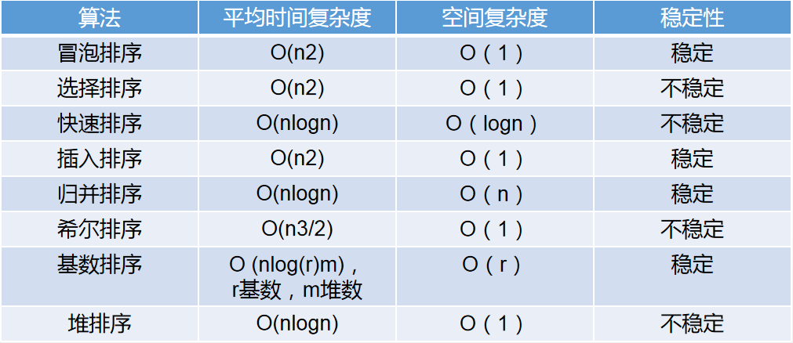

<!-- START doctoc generated TOC please keep comment here to allow auto update -->
<!-- DON'T EDIT THIS SECTION, INSTEAD RE-RUN doctoc TO UPDATE -->
**Table of Contents**  *generated with [DocToc](https://github.com/thlorenz/doctoc)*

- [排序算法](#%e6%8e%92%e5%ba%8f%e7%ae%97%e6%b3%95)
  - [1. 冒泡排序](#1-%e5%86%92%e6%b3%a1%e6%8e%92%e5%ba%8f)
  - [2. 选择排序](#2-%e9%80%89%e6%8b%a9%e6%8e%92%e5%ba%8f)
  - [3. 快速排序](#3-%e5%bf%ab%e9%80%9f%e6%8e%92%e5%ba%8f)
  - [4. 插入排序](#4-%e6%8f%92%e5%85%a5%e6%8e%92%e5%ba%8f)
  - [5. 希尔排序](#5-%e5%b8%8c%e5%b0%94%e6%8e%92%e5%ba%8f)
  - [6. 归并排序](#6-%e5%bd%92%e5%b9%b6%e6%8e%92%e5%ba%8f)
  - [7. 基数排序](#7-%e5%9f%ba%e6%95%b0%e6%8e%92%e5%ba%8f)
  - [8. 堆排序](#8-%e5%a0%86%e6%8e%92%e5%ba%8f)

<!-- END doctoc generated TOC please keep comment here to allow auto update -->

# 排序算法

- 参考资料：
<https://www.cnblogs.com/Glory-D/p/7884525.html>
百度百科

- 概览：



- PS：本文中的排序皆按从小到大排

## 1. 冒泡排序

- 原理：

依次比较相邻两元素，若前一元素大于后一元素，那么交换，直到最后一个元素为最大，然后重新从首元素开始重复操作，直到倒数第二个元素为次大元素；依次类推。这个过程如同冒泡，将较大的元素依次“冒”到尾部

- 实现：

```js
function sort(arr) {
    var temp;
    var i = arr.length;
    while(i > 0) {
        for(let j = 0; j < i-1; j++) {
            if(arr[j] > arr[j+1]) {
                temp = arr[j];
                arr[j] = arr[j+1];
                arr[j+1] = temp;
            }
        }
        i --;
    }
    return arr;
}
```

## 2. 选择排序

- 原理：

首先初始化最小元素的索引值为首元素，依次遍历待排序数列，若遇到小于该最小索引值位置的元素则更新该索引,遍历完一遍后交换最小索引的元素和首元素；然后初始化最小索引值为第二个元素，同样操作，以此类推

- 实现：

```js
function sort(arr) {
    var minIndex;
    var temp;
    for(let i = 1; i < arr.length; i++) {
        minIndex = i - 1;
        for(let j = i; j <arr.length; j++) {
            if(arr[j] < arr[minIndex]) minIndex = j;
        }
        if(minIndex != i-1) {
            temp = arr[i-1];
            arr[i-1] = arr[minIndex];
            arr[minIndex] = temp;
        }
    }
    return arr;
}
```

## 3. 快速排序

- 原理：

选一个基准元素，依次将剩余元素中小于该基准元素的值放在左侧，大于的放在右侧，然后分别针对左右两组元素重复操作,一直递归下去

- 实现：

```js
function sort(arr) {
    const quickSort = (arr, left=0, right=arr.length-1) => {
        if(left >= right) return;
        let i = left, j = right;
        const baseVal = arr[j];
        while(i < j) {
            while(i < j && arr[i] <= baseVal) i++;
            arr[j] = arr[i];
            while(j > i && arr[j] >= baseVal) j--;
            arr[i] = arr[j];
        }
        arr[j] = baseVal;
        quickSort(arr, left, j-1);
        quickSort(arr, j+1, right);
    }
    const newArr = arr.concat();
    sort(newArr);
    return newArr;
}
```

## 4. 插入排序

- 原理：

数组的前面是有序部分（一开始将首元素一个元素看做是有序部分），然后依次取后面无序部分的元素插入到有序部分当中，插入的时候逆序遍历有序部分，找正确位置插入。逆序是为了当数组本身很接近有序的情况下更快速地找到正确位置。

- 实现：

```js
function sort(arr) {
    if(arr == null || arr.length < 2) return arr;
    for(let i = 1; i < arr.length; i ++) {
        for(let j = i - 1; j>=0 && arr[j] > arr[j+1]; j --) {
            let temp = arr[j];
            arr[j] = arr[j+1];
            arr[j+1] = temp;
        }
    }
    return arr;
}
```

## 5. 希尔排序

- 原理：

是插入排序的一种改进版。改进点在于数组整体逐渐趋于有序，使用插入排序时更高效。
希尔排序把元素按下标的一定增量分组，对每组使用直接插入排序；随着增量逐渐减少，每组包含的元素越来越多，当增量减少至1时，整个文件恰被分为一组，算法便终止
一般的初次取序列的一半为增量，以后每次减半，直到为1

- 实现：

```js
function sort(arr) {
    // 增量从长度的一半开始不断减半
    for(let fraction = Math.floor(arr.length/2); fraction > 0; fraction = Math.floor(fraction / 2)) {
        // 插入排序
        for(let i = fraction; i < arr.length; i++) {
            for(let j = i - fraction; j >= 0 && arr[j] > arr[j+fraction]; j -= fraction) {
                let temp = arr[j];
                arr[j] = arr[fraction + j];
                arr[fraction + j] = temp;
            }
        }
    }
    return arr;
}
```

## 6. 归并排序

- 原理：

如果两个子序列是有序的，那么将两个子序列合并后的序列也是有序的。归并排序采用了分治-递归法，将一个序列不断细分成若干个子序列，子序列有序后再向上合并，最终得到有序的总序列

- 实现：

```js
// 合并方法
function merge(left, right) {
    var result = [];
    while(left.length > 0 && right.length > 0) {
        if(left[0] < right[0]) {
            result.push(left.shift());
        } else {
            result.push(right.shift());
        }
    }
    return result.concat(left).concat(right);
}
// 排序
function sort(arr) {
    if(arr.length <= 1) {
        return arr;
    }
    var middle = Math.floor(arr.length/2),
    left = arr.slice(0, middle),
    right = arr.slice(middle);
    return merge(sort(left), sort(right));
}
```

## 7. 基数排序

- 原理：

通过元素大小相关的部分信息（基数），将要排序的元素分类，也就是分配到几个“桶”中，然后串接起来，然后再根据进一步的信息再分配，再串接，以达排序的目的

常见有：

LSD：从数的低位到高位分别作为基数几次分桶串接，适合位数少的数列
MSD：从高位到低位分桶，适合位数多的数列

- 实现：

```js
// 求数组中最大数有多少位
function maxbit(arr) {
    var d = 1, p = 10;
    for(let i = 0; i < arr.length; i ++) {
        while(arr[i] >= p) {
            p *= 10;
            ++d;
        }
    }
    return d;
}
// 排序
function sort(arr) {
    var d = maxbit(arr);
    var temp = [];
    var count = [];
    var i, j, k;
    var radix = 1;
    // d次排序
    for(i = 1; i <= d; i ++) {
        for(j = 0; j < 10; j++) count[j] = 0;
        for(j = 0; j < arr.length; j++) {
            k = Math.floor(arr[j]/radix) % 10;
            count[k] ++;
        }
        for(j = 1; j < 10; j++) {
            count[j] = count[j-1] + count[j];
        }
        for(j = arr.length-1; j >= 0; j--) {
            k = Math.floor(arr[j] / radix) % 10;
            temp[count[k]-1] = arr[j];
            count[k]--;
        }
        for(j = 0; j < arr.length; j++) {
            arr[j] = temp[j];
        }
        radix *= 10;
    }
    return arr;
}
```

## 8. 堆排序

- 原理：

堆是一个近似完全二叉树的结构，堆里的子节点值总是小于或者总是大于它的父节点值

完全二叉树按层次遍历每个节点的索引值有如下规律：
左孩子索引 = 父节点索引 * 2 + 1；
右孩子索引 = 父节点索引 * 2 + 2

最大堆：根节点值最大，每个结点值都比孩子结点大
堆排序借助最大堆实现。将待排序序列构造为完全二叉树并构建最大堆，然后将根节点与最末元素交换，将最末元素（现在是最大的）排除在外重新构建最大堆，然后再将最大堆根节点与堆的最末元素交换，最末两个元素就是排好序的次大与最大，将他们排除在外再构造最大堆……如此将倒序得出排好序的数组。

- 实现：

```js
// 实现最大堆
function maxHeapify(arr, start, end) {
    var dad = start;
    var son = dad * 2 + 1;
    while(son <= end) {
        if( son+1 <= end && arr[son] < arr[son+1]) {
            son++;
        }
        if(arr[dad] > arr[son]) {
            return;
        }
        else {
            var temp = arr[dad];
            arr[dad] = arr[son];
            arr[son] = temp;
            dad = son;
            son = dad * 2 + 1;
        }
    }
}
// 排序
function sort(arr) {
    for(let i = Math.floor(arr.length/2)-1; i >= 0; i--) {
        maxHeapify(arr, i, arr.length - 1);
    }
    for(let i = arr.length-1; i > 0; i--) {
        let temp = arr[0];
        arr[0] = arr[i];
        arr[i] = temp;
        maxHeapify(arr, 0, i-1);
    }
    return arr;
}
```
