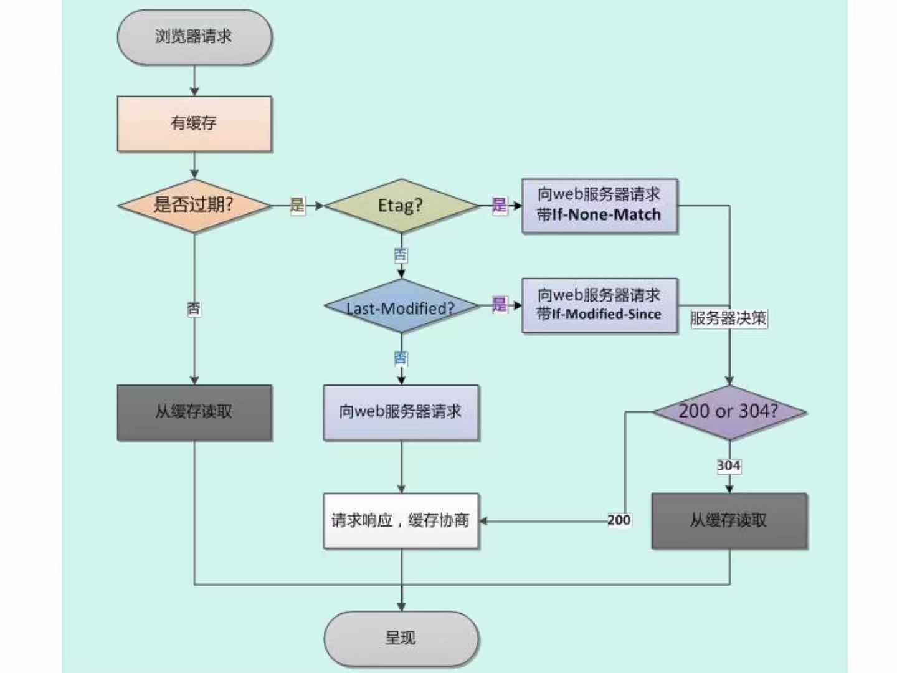

<!-- START doctoc generated TOC please keep comment here to allow auto update -->
<!-- DON'T EDIT THIS SECTION, INSTEAD RE-RUN doctoc TO UPDATE -->
**Table of Contents**  *generated with [DocToc](https://github.com/thlorenz/doctoc)*

- [HTML,HTTP,浏览器](#htmlhttp%e6%b5%8f%e8%a7%88%e5%99%a8)
  - [1. 说一下http和https](#1-%e8%af%b4%e4%b8%80%e4%b8%8bhttp%e5%92%8chttps)
  - [2. tcp三次握手](#2-tcp%e4%b8%89%e6%ac%a1%e6%8f%a1%e6%89%8b)
  - [3. TCP和UDP的区别](#3-tcp%e5%92%8cudp%e7%9a%84%e5%8c%ba%e5%88%ab)
  - [4. WebSocket的实现和应用](#4-websocket%e7%9a%84%e5%ae%9e%e7%8e%b0%e5%92%8c%e5%ba%94%e7%94%a8)
  - [5. http请求的方式，HEAD方式](#5-http%e8%af%b7%e6%b1%82%e7%9a%84%e6%96%b9%e5%bc%8fhead%e6%96%b9%e5%bc%8f)
  - [6. 一个图片的url访问时直接下载怎样实现（不确定）](#6-%e4%b8%80%e4%b8%aa%e5%9b%be%e7%89%87%e7%9a%84url%e8%ae%bf%e9%97%ae%e6%97%b6%e7%9b%b4%e6%8e%a5%e4%b8%8b%e8%bd%bd%e6%80%8e%e6%a0%b7%e5%ae%9e%e7%8e%b0%e4%b8%8d%e7%a1%ae%e5%ae%9a)
  - [7. 说一下web Quality](#7-%e8%af%b4%e4%b8%80%e4%b8%8bweb-quality)
  - [8. 几个很实用的BOM属性对象方法](#8-%e5%87%a0%e4%b8%aa%e5%be%88%e5%ae%9e%e7%94%a8%e7%9a%84bom%e5%b1%9e%e6%80%a7%e5%af%b9%e8%b1%a1%e6%96%b9%e6%b3%95)
  - [9. 说一下HTML5的drag api](#9-%e8%af%b4%e4%b8%80%e4%b8%8bhtml5%e7%9a%84drag-api)
  - [10. 说一下http2.0](#10-%e8%af%b4%e4%b8%80%e4%b8%8bhttp20)
    - [更新](#%e6%9b%b4%e6%96%b0)
    - [特性](#%e7%89%b9%e6%80%a7)
  - [11. 400，401，403状态码](#11-400401403%e7%8a%b6%e6%80%81%e7%a0%81)
  - [12. fetch会发送两次请求的原因](#12-fetch%e4%bc%9a%e5%8f%91%e9%80%81%e4%b8%a4%e6%ac%a1%e8%af%b7%e6%b1%82%e7%9a%84%e5%8e%9f%e5%9b%a0)
  - [13. cookie，sessionStorage，localStorage的区别](#13-cookiesessionstoragelocalstorage%e7%9a%84%e5%8c%ba%e5%88%ab)
  - [14. 说一下webworker](#14-%e8%af%b4%e4%b8%80%e4%b8%8bwebworker)
  - [15. 对html语义化标签的理解](#15-%e5%af%b9html%e8%af%ad%e4%b9%89%e5%8c%96%e6%a0%87%e7%ad%be%e7%9a%84%e7%90%86%e8%a7%a3)
  - [16. iframe是什么 有什么缺点](#16-iframe%e6%98%af%e4%bb%80%e4%b9%88-%e6%9c%89%e4%bb%80%e4%b9%88%e7%bc%ba%e7%82%b9)
  - [17. Doctype的作用 严格模式与混杂模式如何区别 它们有何意义](#17-doctype%e7%9a%84%e4%bd%9c%e7%94%a8-%e4%b8%a5%e6%a0%bc%e6%a8%a1%e5%bc%8f%e4%b8%8e%e6%b7%b7%e6%9d%82%e6%a8%a1%e5%bc%8f%e5%a6%82%e4%bd%95%e5%8c%ba%e5%88%ab-%e5%ae%83%e4%bb%ac%e6%9c%89%e4%bd%95%e6%84%8f%e4%b9%89)
  - [18. cookie如何防范xss攻击](#18-cookie%e5%a6%82%e4%bd%95%e9%98%b2%e8%8c%83xss%e6%94%bb%e5%87%bb)
  - [19. 一句话概括RESTFUL](#19-%e4%b8%80%e5%8f%a5%e8%af%9d%e6%a6%82%e6%8b%acrestful)
  - [20. 讲讲viewport（视口）和移动端布局](#20-%e8%ae%b2%e8%ae%b2viewport%e8%a7%86%e5%8f%a3%e5%92%8c%e7%a7%bb%e5%8a%a8%e7%ab%af%e5%b8%83%e5%b1%80)
    - [px和视口](#px%e5%92%8c%e8%a7%86%e5%8f%a3)
    - [像素](#%e5%83%8f%e7%b4%a0)
    - [视口](#%e8%a7%86%e5%8f%a3)
    - [设备像素比（DPR device pixel redio）](#%e8%ae%be%e5%a4%87%e5%83%8f%e7%b4%a0%e6%af%94dpr-device-pixel-redio)
    - [px与自适应](#px%e4%b8%8e%e8%87%aa%e9%80%82%e5%ba%94)
    - [媒体查询](#%e5%aa%92%e4%bd%93%e6%9f%a5%e8%af%a2)
    - [百分比](#%e7%99%be%e5%88%86%e6%af%94)
    - [rem](#rem)
  - [21. click在ios上有300ms的延迟，原因和解决办法](#21-click%e5%9c%a8ios%e4%b8%8a%e6%9c%89300ms%e7%9a%84%e5%bb%b6%e8%bf%9f%e5%8e%9f%e5%9b%a0%e5%92%8c%e8%a7%a3%e5%86%b3%e5%8a%9e%e6%b3%95)
  - [22. addEventListener参数](#22-addeventlistener%e5%8f%82%e6%95%b0)
  - [23. iframe通信，同源和不同源两种情况，有多少种方法](#23-iframe%e9%80%9a%e4%bf%a1%e5%90%8c%e6%ba%90%e5%92%8c%e4%b8%8d%e5%90%8c%e6%ba%90%e4%b8%a4%e7%a7%8d%e6%83%85%e5%86%b5%e6%9c%89%e5%a4%9a%e5%b0%91%e7%a7%8d%e6%96%b9%e6%b3%95)
  - [24. 介绍http返回的状态码](#24-%e4%bb%8b%e7%bb%8dhttp%e8%bf%94%e5%9b%9e%e7%9a%84%e7%8a%b6%e6%80%81%e7%a0%81)
  - [25. http常用请求头](#25-http%e5%b8%b8%e7%94%a8%e8%af%b7%e6%b1%82%e5%a4%b4)
  - [26. 强，协商缓存](#26-%e5%bc%ba%e5%8d%8f%e5%95%86%e7%bc%93%e5%ad%98)
  - [27. 讲讲304](#27-%e8%ae%b2%e8%ae%b2304)
  - [28. 前端优化](#28-%e5%89%8d%e7%ab%af%e4%bc%98%e5%8c%96)
  - [29. get和post的区别](#29-get%e5%92%8cpost%e7%9a%84%e5%8c%ba%e5%88%ab)
  - [30. 301和302的区别](#30-301%e5%92%8c302%e7%9a%84%e5%8c%ba%e5%88%ab)
  - [31. http支持的请求方式](#31-http%e6%94%af%e6%8c%81%e7%9a%84%e8%af%b7%e6%b1%82%e6%96%b9%e5%bc%8f)
  - [32. 如何画一个三角形](#32-%e5%a6%82%e4%bd%95%e7%94%bb%e4%b8%80%e4%b8%aa%e4%b8%89%e8%a7%92%e5%bd%a2)
  - [33. 304和200](#33-304%e5%92%8c200)
  - [34. 说一下浏览器缓存](#34-%e8%af%b4%e4%b8%80%e4%b8%8b%e6%b5%8f%e8%a7%88%e5%99%a8%e7%bc%93%e5%ad%98)
  - [35. html5新增的元素](#35-html5%e6%96%b0%e5%a2%9e%e7%9a%84%e5%85%83%e7%b4%a0)
  - [36. 在地址栏里输入一个url到页面呈现出来，中间发生了什么](#36-%e5%9c%a8%e5%9c%b0%e5%9d%80%e6%a0%8f%e9%87%8c%e8%be%93%e5%85%a5%e4%b8%80%e4%b8%aaurl%e5%88%b0%e9%a1%b5%e9%9d%a2%e5%91%88%e7%8e%b0%e5%87%ba%e6%9d%a5%e4%b8%ad%e9%97%b4%e5%8f%91%e7%94%9f%e4%ba%86%e4%bb%80%e4%b9%88)
    - [过程](#%e8%bf%87%e7%a8%8b)
    - [请求时的缓存](#%e8%af%b7%e6%b1%82%e6%97%b6%e7%9a%84%e7%bc%93%e5%ad%98)
  - [37. cache-control的值有哪些](#37-cache-control%e7%9a%84%e5%80%bc%e6%9c%89%e5%93%aa%e4%ba%9b)
  - [38. csrf和xss的网络攻击和防范](#38-csrf%e5%92%8cxss%e7%9a%84%e7%bd%91%e7%bb%9c%e6%94%bb%e5%87%bb%e5%92%8c%e9%98%b2%e8%8c%83)
  - [39. 怎么看网站的性能如何](#39-%e6%80%8e%e4%b9%88%e7%9c%8b%e7%bd%91%e7%ab%99%e7%9a%84%e6%80%a7%e8%83%bd%e5%a6%82%e4%bd%95)
  - [40. 介绍HTTP协议](#40-%e4%bb%8b%e7%bb%8dhttp%e5%8d%8f%e8%ae%ae)
  - [41. 具体有哪些请求头是跟缓存相关的](#41-%e5%85%b7%e4%bd%93%e6%9c%89%e5%93%aa%e4%ba%9b%e8%af%b7%e6%b1%82%e5%a4%b4%e6%98%af%e8%b7%9f%e7%bc%93%e5%ad%98%e7%9b%b8%e5%85%b3%e7%9a%84)
  - [42. cookie有哪些字段可以设置](#42-cookie%e6%9c%89%e5%93%aa%e4%ba%9b%e5%ad%97%e6%ae%b5%e5%8f%af%e4%bb%a5%e8%ae%be%e7%bd%ae)
  - [43. cookie有哪些编码方式](#43-cookie%e6%9c%89%e5%93%aa%e4%ba%9b%e7%bc%96%e7%a0%81%e6%96%b9%e5%bc%8f)

<!-- END doctoc generated TOC please keep comment here to allow auto update -->

# HTML,HTTP,浏览器

## 1. 说一下http和https

https的ssl加密是在传输层实现的。

（1）http和https的概念

http：超文本传输协议，是互联网上应用最为广泛的一种网络协议。是一个客户端和服务端请求和应答的标准。用于从www服务器传输超文本到本地浏览器的传输协议。它可以使浏览器更加高效，使网络传输减少。

https：是以安全为目标的http通道，简单讲就是http的安全版。即在http下加入ssl层，https的安全基础就是ssl，因此加密的详细内容就需要ssl

https协议的主要作用就是建立一个信息的安全通道，来确保数据的传输，确保网站的真实性。

（2）http和https的区别？

http是超文本传输协议，信息是明文传输，https则是具有安全性的ssl加密传输协议。

使用不同的链接方式，端口也不同，一般而言，http协议的端口为80，https的端口为443

http的链接很简单，是无状态的；https协议是由ssl+http协议构建的可进行加密传输、身份认证的网络协议，比http协议安全

（3）https协议的工作原理

客户端在使用https方式与web服务器通信时有以下几个步骤：

1. 客户端使用https url访问服务器，则要求web服务器建立ssl链接
2. Web服务器收到客户端的请求后，会将网站的证书（包含了公钥）返回或者说传给客户端
3. 客户端和服务端开始协商ssl链接的安全等级，也就是加密等级
4. 客户端浏览器通过双方协商一致的安全等级，建立会话秘钥，然后通过网站的公钥来加密会话秘钥，并传送给网站
5. web服务器用自己的私钥解密出会话秘钥
6. web服务器通过会话秘钥加密与客户端通信

（4）https的优点

https是由ssl+http协议构建的可进行加密传输的、身份认证的网络协议，要比http协议安全，可防止数据在传输过程中不被窃取、改变，确保数据的完整性

https是现行架构下最安全的解决方案，虽然不是绝对安全，但他大幅增加了中间人攻击的成本

（5）https的缺点

https握手阶段比较费时，会使页面加载时间延长，耗电增加

https缓存不如http高效，会增加数据的开销

ssl证书也需要花钱，功能越强大的证书费用越高

ssl证书需要绑定IP，不能再同一个ip上绑定多个域名，Ipv4资源支持不了这样的消耗

## 2. tcp三次握手

客户端和服务端都需要知道各自可收发，因此需要三次握手

```bash

                  C                   S
                          SYN=1
                     ---------------> 确认自己可以接收
                        SYN=1,ACK
   确定s可收，自己可收 <--------------
                            ACK
                     ---------------> 确认C可收
```

## 3. TCP和UDP的区别

（1）TCP是面向连接的，UDP是无连接的，即发送之前不需要先建立连接
（2）TCP提供可靠的服务。也就是说，通过TCP连接传输数据，无差错，不丢失，不重复，且按序到达；UDP尽最大努力交付，即不保证可靠交付。正因如此，TCP适合大数据量的交换
（3）TCP是面向字节流，UDP是面向报文，并且网络出现拥塞不会使发送速率降低（因此会出现丢包，实时的应用如ip电话和视频会议等）
（4）TCP是一对一，UDP支持一对一，一对多
（5）TCP的首部较大为20字节，而UDP只有8字节
（6）TCP是面向连接的可靠性传输，而UDP是不可靠的

## 4. WebSocket的实现和应用

（1）什么是webSocket？

WebSocket是html5中的协议，支持持久连接。http协议不支持持久连接，http1.0和http1.x都不支持持久性连接，http1.1中的keep-alive将多个http请求合并为1个。

（2）websocket是什么样的协议，具体有什么优点

HTTP的生命周期通过Request来界定，也就是Request一个response，那么在http1.0协议中这次请求就结束了；在http1.1中进行了改进，是有一个connection：keep-alive，也就是说在一个http连接里可以发送多个request，接收多个response。

Websocket是基于http协议的，或者说借用了http协议来完成部分握手，在握手阶段和http是相同的，请求头中多了两个属性：upgrade，connection

```bash
Upgrade: websocket
Connection: Upgrade
```

## 5. http请求的方式，HEAD方式

head：类似于get请求，只不过返回的响应中没有具体的内容，用户获取报头
options：允许客户端查看服务器的性能，比如说服务器支持的请求方式等等

## 6. 一个图片的url访问时直接下载怎样实现（不确定）

请求图片的头里添加：content-type:image/png

## 7. 说一下web Quality

网站的可读性。
为图像添加alt属性，当图像不能正常显示时显示alt信息，或者浏览器可以为残障人士读出alt内容。

## 8. 几个很实用的BOM属性对象方法

（1）location对象

location.href：返回或者设置当前文档的url
location.search：返回URL中的查询字符串部分，返回包括？和？之后的内容
location.hash：返回url“#”之后的内容，如果没有#，就返回空
location.host：返回url中域名部分，例如www.baidu.com
location.hostname：返回url中主域名的部分，例如baidu.com
location.pathname：返回url域名后的部分，例如...baidu.com/xxx/api/会返回/xxx/api/
location.port：返回url中的端口
location.protocol：返回//前面的协议部分，比如http:
location.assign：设置当前文档的url
location.replace(newUrl)：使用新文档取代当前文档，并且在history对象的地址列表中移除当前文档的url
location.reload()：重新加载

（2）history对象

history.go()：前进或后退指定页面数
history.back()：回退一页
history.forward()：前进一页

（3）navigator对象

navigator.userAgent：返回用户代理头的字符串表示（就是包括当前浏览器版本信息等的字符串）
navigator.cookieEnabled：返回浏览器是否支持（启用）cookie

## 9. 说一下HTML5的drag api

在HTML5中拖放是标准的一部分，任何元素都能拖放。

```html
<!DOCTYPE HTML>
<html>
<head>
    <script type="text/javascript">
    // 当拖动到某一元素里时对该元素调用的函数
        function allowDrop(ev) {
            // // 阻止默认行为（默认无法将某元素放置到另一元素里）
            ev.preventDefault();
        }
        // 拖动时调用的函数
        function drag(ev) {
            // 拖动时设置被拖动数据的数据类型和值（这里是它的id），也就是拖动时我们把他的id存成data方便后续找到它
            ev.dataTransfer.setData("Text",ev.target.id);
        }
        // 当放置元素时对位置所在的元素调用的函数
        function drop(ev){
            // 阻止默认行为（默认无法将某元素放置到另一元素里）（drop 事件的默认行为是以链接形式打开）
            ev.preventDefault();
            // 取到拖动时存储的id数据
            var data=ev.dataTransfer.getData("Text");
            // 
            ev.target.appendChild(document.getElementById(data));
        }
    </script>
</head>
<body>
    <!-- ondrop="drop(event)放置被拖动数据时触发的函数  ondragover="allowDrop(event)"规定何处放置被拖动的元素  -->
    <div id="div1" ondrop="drop(event)" ondragover="allowDrop(event)"></div>
    <!-- draggable="true"能否被拖动  ondragstart="drag(event)"拖动时触发的函数 -->
    
</body>
</html>
```

## 10. 说一下http2.0

### 更新

- http2.0是基于1999年发布的http1.0之后的首次更新
- 提升访问速度（请求资源所需的时间更少，访问速度更快，相比于1.0）
- 允许多路复用：多路复用允许同时通过单一的HTTP/2连接发送多重请求-响应信息。改善了：在http1.1中浏览器客户端在同一时间，针对同一域名下的请求有一定数量的限制，超过限制会发生阻塞
- 二进制分帧：http2.0会将所有的传输信息分割为更小的信息或者帧，并对他们进行二进制编码
- 首部压缩
- 服务器端推送

### 特性

1. 内容安全。http2.0是基于https的，天然具有安全性，通过http2.0的特性可以避免单纯使用https造成的性能下降
2. 二进制格式。http2.0将所有的传输信息分割为更小的消息和帧，并对他们采用二进制格式编码，基于二进制让协议有更多的扩展性，比如引入了帧来传递数据和指令
3. 多路复用。这个功能相当于长连接的增强，每个request可以随机地混杂在一起，接收方也可以根据request的id将request再归属于各自不同的服务端请求里，另外多路复用中也支持了流的优先级，允许客户端告诉服务器哪些内容是更优先的资源，可以优先传输

## 11. 400，401，403状态码

400：请求无效，找不到对应的资源
401：要求验证身份
403：服务器得到请求，但是拒绝执行

## 12. fetch会发送两次请求的原因

fetch发送post请求时总是发送两次，第一次状态码是204，第二次才会成功。
原因是，用fetch发送post请求时，第一次发送了一个options请求，询问服务器是否支持修改的请求头，如果支持，则在第二次发送真正的请求

## 13. cookie，sessionStorage，localStorage的区别

共同点：都是保存在浏览器端，并且是同源的

cookie：cookie数据始终在同源的http请求中携带，即cookie在浏览器和服务器间来回传递。而sessionStorage和localStorage不会自动把数据发送给服务器，仅在本地保存。cookie还有path的概念，可以限制cookie只属于某个路径下，存储的大约在4k左右；cookie只在设置的过期时间之前一直有效。作用：1. 保存用户登录状态。2. 跟踪用户行为，记住用户上次的行为。3. 定制页面，保存用户上次选择的界面风格。
sessionStorage：仅在当前浏览器窗口关闭前有效，自然就不可能持久保存。
localStorage：始终有效，窗口或浏览器关闭之后也能存在，因此做持久数据。在所有同源窗口中都是共享的；

## 14. 说一下webworker

在html页面中，如果在执行脚本时，页面的状态是不可响应的，直到脚本执行完成后页面才变为可响应。web worker是运行在后台的js，独立于其他脚本，不会影响页面。并且通过postMessage将结果回转至主线程。

【webworker的使用】

## 15. 对html语义化标签的理解

html5标签语义化是指正确的标签包含了正确的内容，结构良好，便于阅读

## 16. iframe是什么 有什么缺点

iframe元素会创建包含另一个文档的内联框架

可以将提示文字放在 <iframe></iframe> 之间来提示某些不支持iframe的浏览器

缺点：
会阻塞主页面的onload事件
搜索引擎无法读取这种页面，不利于seo
iframe与主页面共享连接池，而浏览器对于相同区域有限制所以会影响性能

## 17. Doctype的作用 严格模式与混杂模式如何区别 它们有何意义

DOCTYPE声明于文档的最前面，告诉浏览器以何种方式来渲染页面，有两种模式：
严格模式：以该浏览器支持的最高标准运行
混杂模式：向后兼容，模拟老浏览器，防止浏览器无法兼容页面

## 18. cookie如何防范xss攻击

XSS（跨站脚本攻击）是指攻击者在返回的HTML中嵌入js脚本，为了减轻这些攻击，需要在HTTP头部配上set-cookie：

httponly：这个属性可以防止xss，他会禁止js脚本访问cookie
secure：这个属性告诉浏览器仅在请求为https时发送cookie

## 19. 一句话概括RESTFUL

用url定位资源，用http描述操作

## 20. 讲讲viewport（视口）和移动端布局

### px和视口

在静态网页中我们经常使用像素（px）作为单位，来描述一个元素的宽高以及定位信息，在pc端，通常认为css中1px所表示的真实长度是固定的。

然而px不是固定大小的，同一px值在pc端和移动端显示的大小是不同的，即不同端的px单位大小不同。

### 像素

像素是网页布局的基础，一个像素表示了计算机屏幕所能显示的最小区域，像素分为两种：逻辑像素（css像素）和物理像素。
我们在js或者css代码中使用的px单位是指逻辑像素，物理像素也成设备像素，只与设备或者说硬件有关，同样尺寸的屏幕，设备的密度越高，物理像素也就越多。

### 视口

广义的视口是指浏览器内显示内容的屏幕区域，狭义的视口包括了布局视口、视觉视口、理想视口

（1）布局视口（layout viewport）

布局视口定义了pc网页在移动端的默认布局行为，因为通常pc的分辨率比较大，布局视口默认为980px，也就是说在不设置网页的viewport的情况下，pc端的网页会默认以布局视口为基准，在移动端进行显示。因此我们可以看出来默认为布局视口时，根植于pc端的网页在移动端展示很模糊。

（2）视觉视口（visual viewport）

视觉视口表示浏览器内看到的网站的显示区域，用户可以通过缩放来查看网页的显示内容，从而改变视觉视口。视觉视口的定义，就像拿着一个放大镜分别从不同距离观察同一个物体，视觉视口仅仅类似于方放大镜中显示的内容，因此视觉视口不会影响布局视口的宽度和高度

（3）理想视口

理想视口的全称应该是“理想的布局视口”，在移动设备中就是指设备的分辨率，换句话说理想视口/分辨率就是给定设备物理像素的情况下最佳的“布局视口”

### 设备像素比（DPR device pixel redio）

1DPR = 物理像素/分辨率    也就是物理像素在屏幕上最佳的逻辑像素大小

在不缩放的情况下，一个逻辑像素就等于一个DPR，即1逻辑像素 = 物理像素/分辨率

在移动端布局中我们可以通过viewport元标签来控制布局：

```html
<!-- width：定义布局视口的宽度，单位为像素；
height：定义布局的高度，单位为像素；
initial-scale[0,10]：初始缩放比例，1表示不缩放；
minimum-scale[0,10]：最小缩放比例；
maximum-scale[0,10]：最大缩放比例；
user-scalable{yes,no}：是否允许手动缩放页面，默认yes -->
<meta id="viewport" name="viewport" content="width=device-width;initial-scale=1.0;maximum-scale=1;user-scalable=no;">
```

- 把width设置为device-width，表示分辨率的宽设为了布局视口的宽度，也就是实现了理想视口

### px与自适应

1逻辑像素 = 物理像素/分辨率

若某移动端的分辨率宽为375，在pc端分辨率为980，我们需要的实际长度是750px（物理px），那么就有：

1逻辑像素（pc） = 750 / 980 = 0.76px
1逻辑像素（m） = 750 / 375 = 2px

也就是说在pc端一个逻辑像素由0.76个物理像素表示，移动端一个逻辑像素由2个物理像素表示。如果我在css中字体大小用16px表示，那么在移动端就是32个物理像素大小，而pc端是12.16个物理像素大小，视觉上的大小就肯定不一样了。

### 媒体查询

由于不同端下的分辨率不同，导致同一逻辑像素显示出来的效果也不一样，所以我们想到针对不同端的不同分辨率各实现一套样式。

使用@media媒体查询可以针对不同的媒体类型定义不同的样式。

### 百分比

css样式中的百分比所依据的对象因属性而异：

- height,width：相对于子元素的直接父元素的height,width
- padding,margin：相对于直接父元素的width
- top,bottom：相对于直接非static定位的父元素的高度
- left,right：相对于直接非static定位的父元素的宽度
- border-radius,translate,background-size：相对于自身的宽度

### rem

rem是一个灵活的可扩展的单位，有浏览器转化像素并显示。与em不同，rem单位不论嵌套层级关系如何，都只相对于浏览器的根元素（HTML）的font-size。默认情况下html元素的font-size为16px，所以1rem=16px

通常为了计算方便，我通常会设置：

```css
html {
    font-size: 62.5%
}
```

这个意思是默认字体尺寸的62.5%，也就是 16*62.5%=10px，此时我们就有1rem = 10px。

## 21. click在ios上有300ms的延迟，原因和解决办法

苹果上有一个双击缩放网页的功能，当第一次click时候浏览器会等待300ms判定用户是否要双击，所以点击一次后会延迟300ms才发生click事件

1. 禁用缩放：

    ```html
    <meta name="viewport" content="width=device-width;user-scalable=no;">
    ```

2. 利用fastClick：

检测到touchend事件时立即发出模拟click事件，并且把浏览器300ms后发出的点击事件给阻断掉

## 22. addEventListener参数

addEventListener(event(监听的事件名), function（事件触发时要执行的函数）, useCapture（是否冒泡）)

## 23. iframe通信，同源和不同源两种情况，有多少种方法

[]

## 24. 介绍http返回的状态码

[]

## 25. http常用请求头

[]

## 26. 强，协商缓存

强缓存：资源从缓存中获取，相关字段有expires，cache-control
协商缓存：last-modified  if-modified-since  Etag  if-none-match


## 27. 讲讲304

如果客户端发送了一个带条件的get请求且该请求已被允许，而文档的内容没有更新，则服务器返回304状态码

## 28. 前端优化

- 降低请求量：合并资源，减少http请求数，minify/gzip压缩，webP，lazyload
- 加快请求速度：预解析DNS，减少域名数，并行加载，CDN分发[]
- 缓存：HTTP协议缓存请求，离线缓存manifest，离线数据缓存localStorage
- 渲染：js、css优化，加载顺序，服务端渲染，pipeline

## 29. get和post的区别

- get参数通过url传递，post放在request的body中
- get请求在url中传递的参数是有长度限制的，post没有
- get请求比post请求更不安全，因为参数直接暴露在url中，不适合传递敏感信息
- get请求只能进行url编码，而post请求支持多种编码
- get请求浏览器会主动cache，而post不会
- get请求参数会被完整地保留在浏览器的历史记录中，而post中的参数不会
- get和post本质上都是TCP连接，并无差别
- get产生一个TCP数据包，POST产生两个TCP数据包

## 30. 301和302的区别

- 301表示被请求的资源已经永久地移动到了新位置，并且将来任何对此资源的引用都应该使用本响应返回若干个uri之一。如果可能，拥有链接编辑功能的客户端应当自动把请求的地址修改为从服务器反馈回来的地址。除非额外指定，否则这个响应也是可以缓存的。
- 302表示请求的资源现在临时从不同的uri响应请求，由于这样的重定向是临时的，客户端应当继续向原有地址发送以后的请求。只有在cache-Control或expires中进行了指定的情况下，这个响应才是可缓存的。
- 字面上的有区别就是301是永久重定向，302是临时重定向
- 301比较常见的场景是使用域名跳转。302用来做临时跳转，比如未登录的用户访问用户中心重定向到登录页面，但是登陆之后访问用户中心则会正常访问到。

## 31. http支持的请求方式

get，post，options，head，delete，put，connect，trace

## 32. 如何画一个三角形

```css
div {
    width: 0px;
    height: 0px;
    border-width: 100px;
    border-style: solid;
    border-color: transparent transparent red red;
}
```

## 33. 304和200

200：请求已成功，请求请求所希望的响应头会数据体将随此响应返回，即返回的数据为全量的数据，如果文件不通过gzip压缩的话，文件有多大就有多大的传输量
304：如果客户端发了一个带条件的get请求，且该请求已被允许，而文档内容（自上次的请求以来或者根据请求的条件）并没有改变，则服务器返回这个状态码，只是做了个文件是否更新的校验

## 34. 说一下浏览器缓存

浏览器缓存有四种实现方法：

1. Service Worker
2. Memory Cache
3. Disk Cache
4. Push Cache

浏览器的缓存策略有两种：

1. 强缓存（相关字段有expires，cache-control）
2. 协商缓存（相关字段有Last-Modified/If-Modified-Since,Etag/If-None-Match）

## 35. html5新增的元素

语义化标签：header,footer,nav,aside,section
增强表单：为input增加了color,email,data,range等类型
存储：sessionStorage，localStorage，离线存储
多媒体：audio，vedio
canvas
拖放
地理定位
webworker
websocket

## 36. 在地址栏里输入一个url到页面呈现出来，中间发生了什么

### 过程

- 输入url，查询对应ip（dns解析）
  - 先查找缓存：浏览器缓存->系统缓存->路由器缓存
  - 没有查到则查找系统的hosts文件中是否有记录，
  - 没有则查询DNS服务器
- 建立tcp连接
- 根据ip和端口号构建一个http请求，封装为tcp包，请求传输：应用层->传输层->网络层->数据链路层->物理层
- 到达服务器，服务器解析请求作出响应
- 浏览器接收到html构建DOM树（中途如果遇到js就会停止构建而去执行会下载脚本）
- 构建CSSOM树
- 合并两树为渲染树（排除了非视觉结点）
- 布局（确定个元素的尺寸和位置）
- 渲染页面

### 请求时的缓存

缓存一般通过cache-control，last-modify，expires等首部字段控制，cache-control和expires区别在于cache-control使用相对时间，而expires使用基于服务器的绝对时间，因为存在时差问题，所用通常使用cache-control。
在请求这些的有设置了缓存的数据时，会先查看是否过期，如果没有过期则直接使用本地缓存，过期则请求校验这些文件是否更改，如果上次上应设置了ETag值，那么这次请求时他就会作为If-no-match的值交给服务器端校验，如果一致继续校验last-modified，没有设置ETag的则直接校验last-modified，再决定是否返回304

## 37. cache-control的值有哪些

cache-control是一个通用消息头字段，被用于HTTP请求和响应中。通过指定指令来实现缓存机制，这个缓存指令是单向的，常见的取值有：

- private(默认)
- no-cache
- max-age
- must-revalidate

## 38. csrf和xss的网络攻击和防范

CSRF：跨站请求伪造，可以理解为攻击者盗用了用户的身份，以用户的名义发送了恶意请求，比如用户登录了一个网站后立刻在另一个tab页面访问攻击者用来制造攻击的网站，这个网站要求访问刚刚登录的网站，并发送了一个恶意请求，这时候CSRF就产生了，比如这个制造攻击的网站使用一张图片，但是这种图片的链接却是可以修改数据库的，这时候攻击者就可以以用户的名义操作这个数据库，防御的话：使用验证码，检查HTTPS、头部的refer、，使用token

XSS：跨站脚本攻击。是说攻击者通过注入恶意的脚本，在用户浏览网页时进行攻击，比如获取cookie或者其他用户身份信息，可以分为存储型和反射型，存储型时攻击者输入一些数据并且存储到了数据库中，其他浏览者看到的时候攻击，反射型的话不存储在数据库中，往往表现为将攻击代码放在URL地址的请求参数中，防御的话：为cookie设置HTTPonly属性，对于用户的输入进行检查，进行特殊字符过滤。

## 39. 怎么看网站的性能如何

检查页面加载时间的方式一般有两种，一种是被动去测，就是在被监测页面置入脚本或探针，当用户访问网页时探针自动采取数据并传回数据库进行分析，另一种主动监测的方式，即主动的搭建分布式受控环境，模拟用户发起页面访问请求，主动采集性能数据进行分析，在监测的精准度上，专业的第三方工具效果更佳，比如说性能极客

## 40. 介绍HTTP协议

HTTP是一个基于TCP/IP通信协议来传递数据（HTML文件，图片文件，查询结果等）的属于应用层的面向对象的协议，由于其简捷、快速的方式，适用于分布式超媒体信息系统。
HTTP协议工作于客户端-服务端架构上，浏览器作为HTTP、客户端通过URL向http服务器端即web服务器发送所有请求，web服务器根据接收到的请求后，向客户端发送响应信息。

## 41. 具体有哪些请求头是跟缓存相关的

强缓存相关字段：expires，cache-control
协商缓存相关字段：last-modified/if-modified-since。ETag/if-none-match

## 42. cookie有哪些字段可以设置

name：一个cookie的名称
value：一个cookie的值
domain：可访问此cookie的域名

非顶级域名，如二级域名或者三级域名设置的cookie的domain只能为顶级域名或者二级域名或者三级域名本身，不能设置其他二级域名的cookie，否则cookie无法生成

顶级域名只能设置domain为顶级域名，不能设置为低于顶级域名的等级域名

二级域名能读取设置了domain为顶级域名或者自身的cookie，不能读取其他二级域名domain的cookie。所以如果想要cookie在多个二级域名中共享，那就需要设置domain为顶级域名，这样就可以在所有二级域名中得到这个cookie的值了

path：为可以访问此cookie的页面路径。比如domain是abc.com，path为/test，那么只有/test路径下的页面可以读取此cookie

expires/max-age：字段为此cookie的过期时间，若设置其值为一个时间，那么当到达此时间后此cookie失效，不设置的话默认值是session，意思是和session一起失效。当浏览器关闭后，此cookie失效

size：此cookie的大小

http：cookie的httponly属性，若此属性为true，则只有在http请求头中会带有此cookie的信息，而不能通过document.cookie来访问此cookie

secure：设置是否只能通过https来传递此条cookie

## 43. cookie有哪些编码方式

encodeURI（）
