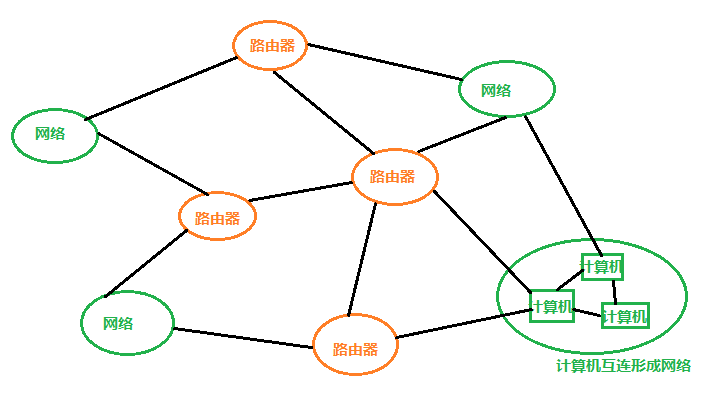
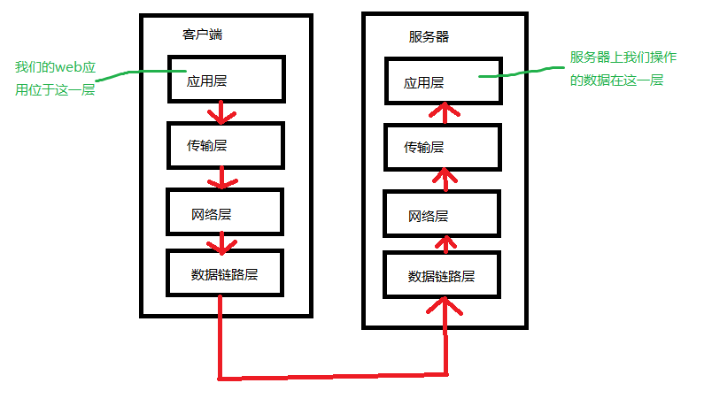
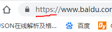
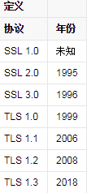
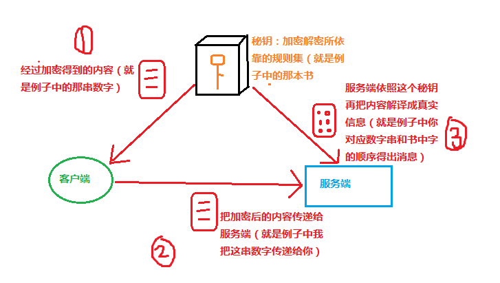
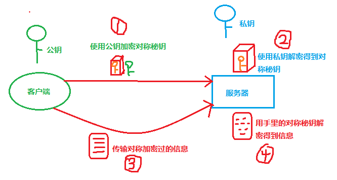
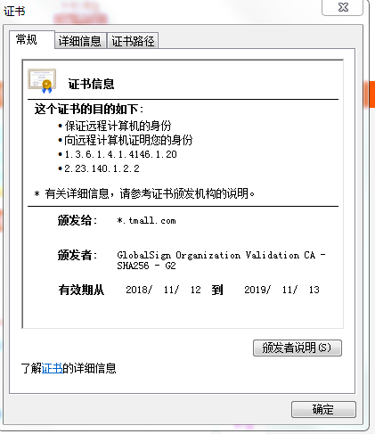

# https

- 参考资料：
- 《图解http》
- 《高效前端》
- <http://www.ruanyifeng.com/blog/2014/02/ssl_tls.html>

- 这篇文章可以说是上一篇http的续集，如果还没有对http有所理解，请看上一篇文章：[http](./http.md)

- https，超文本传输安全协议，简单理解为是加了一层防护甲（SSL）的http，更加安全。

## http协议的缺点

- 为什么要产生一个https呢？那肯定是因为http的一些缺点无法被忽略，所以出现了加强版的http——https。

- 具体的一些主要缺点如下：

### 1. 通信内容赤果果地暴露在线路上，内容会被窃听

- 先来看看互联网长啥样：



- 结合前面讲的，再看看我们的http报文传递在这里面是怎么传递的：
- 数据从一台计算机的应用层下传到数据链路层，然后沿着这个互联网上的线路出发，经过数个中转站（路由器）的转发，到达目标机器的数据链路层，然后上传至应用层。

- 互联网连接着地球上四面八方的计算机，不是私有物，而http报文在这个网上传输时是明文（未加密）传输的，那么如果有心人想要窥视截获你的数据，那就是轻而易举的。这好像皇帝出游没有易容易装，我站在皇帝的必经之路上就可以很容易地抓到这个皇帝。
- 有个软件叫Wireshark，可以轻而易举地捕捉到网络中的数据包，感兴趣的可以试试。

### 2. 不验证通信方的身份，因此有可能遭遇伪装

- 之前我们讨论过http通信的过程：客户端发出请求，服务器处理并响应。
- 在这个过程中我们可以看到，对于请求，服务器不会选择我接收还是不接收，而客户端也不关心，我得到的响应，是不是真的是我要求的那个服务器传来的。
- 也就是说，在http协议下的请求和响应对于通信的双方都不会进行确认。
- 这会导致什么问题呢？
    1. 不确定客户端或者服务器是不是伪装的：发来请求的客户端可能是个假冒的来骗取信息的，或者服务器是假冒的返回了欺骗客户端的假信息
    2. 所有请求服务器都照单全收（全部会进入处理流程），当有人恶意发起大量无意义请求时可能会造成服务器崩溃，导致无法处理正常请求（Dos攻击，即拒绝服务攻击）
    3. 等等
- 由于请求和响应来源的不确定性，我们可以看到会出现很多安全问题。

### 3. 无法证明报文的完整性，有可能拿到的报文已经被改过了

- 经由互联网上的传输，客户端发出的请求内容到了服务器手里一定是原内容吗？服务器传给客户端的数据一定是原数据吗？
- 经过上面的讨论，答案很明显了：不一定。
- 如果皇帝出游时我半路拦截了皇帝，然后把他绑架了，我或者另找个人易容易装成皇帝再回宫，那皇帝就不是原来的皇帝了。
- 这种半路拦截数据并进行篡改的恶意攻击，我们称之为中间人攻击（MITM）。

## https原理

- 与SSL或TLS组合使用的http成为HTTPS。

- 还记得我们之前讲的http通信流吗：

- 我们把这一过程放大了看，在各层传递数据的时候会在各层依据各层的协议对数据进行包装（加各种首部），应用层产生了http报文，然后传递给传输层再包装产生TCP报文。以SSL为例，当我们将http和SSL组合使用时就变成了http先传递给SSL，加上防护盾后传递给TCP层，如下图所示：


- 所以https不能称之为一种新的协议，它只是代表http和其他协议的组合使用。
- 使用https方式通信的网站我们可以看到它在浏览器里地址栏中的URI开头标明：



### https中对于http缺陷的弥补

1. 通信内容赤果果地暴露在线路上，内容会被窃听：通信加密，将通信内容使用SSL或TLS加密（经常被比拟为创造了一条安全通道传输信息）
2. 不验证通信方的身份，因此有可能遭遇伪装：使用可信任的第三方颁发的证书完成身份的确认
3. 无法证明报文的完整性，有可能拿到的报文已经被改过了：SSL的摘要功能提供完整性保护

- 让我们从概念入手，深入了解这些具体是什么操作。

### 啥是SSL

- 还是看一看这个图：


- SSL，安全套接层，根据上面的流程图我们就可以很容易地理解它名字的含义了。SSL层位于应用层和传输层之间，http报文从应用层出来后就会经过SSL这个中间层的安全加工，然后才会交给TCP层。

- SSL的安全加工具体是做了什么工作呢：（这不是废话？。当然就是上面提到的https里的改进点啦）
  1. 加密
  2. 证书
  3. 完整性保护

- SSL是一种位于应用层和传输层之间的独立的网络安全技术，这里需要明确的一点是，不仅仅http，其他运作在应用层的协议产生的报文，均可利用SSL技术进行安全加工。
- 怕有的同学在这里还搞不清楚SSL到底是个什么东西，我再重申一次，SSL本质上是协议（有时候也可见称此类协议为安全协议），协议我们简单理解为通信的规则/语法，SSL的协议规则下的操作，将报文变得更安全。SSL的身份，可以简单类比战争片里约定某种编码规则加密信号，比如我给接头人一串数字，数字代表了某本书里的第几个字第几个字连起来，按此规则传递消息别人不知道真实内容——当然SSL的规则没这么简单。

### 啥是TLS

- TLS，安全传输层协议。讲到这里你可能会有疑问：TLS和SSL有什么关系？
- 答案在下面这张来自百度百科的图里：



- 由上图可知，TLS是SSL的改进版，由SSL发展而来。
- 特别摘出以下两句话帮助理解：
- TLS是以SSL为原型开发的协议，有时会统一称该协议为SSL。 ——《图解HTTP》
- IETF将SSL标准化，即RFC 2246，并将其称为TLS。——百度百科“TLS”

- 具体差别不在本文讨论范围内，接下来介绍的“安全加工”的原理内容二者互通。

### 1. 怎样实现的通信加密

- 加密的方法有很多种。
- 如果是你给一段信息加密，你会怎么加密，从而只让通信的双方得到真实信息呢？

#### 对称加密

- 我之前提到的战争片里传递加密消息就是一种方法：我按照我们约定好的一本书里的字的顺序，拣出我要的字并记录顺序，然后把这段数字传给你，你再按照这本书里的字对应于数字串得出真实消息，这是一个加密办法。但我们看战争片里这种行为很容易出现的坏结果是什么——敌人拿到了这本书，gg。
- 如果你理解这个过程，那你就理解了什么是“共享秘钥加密”，也叫“对称秘钥加密”——这是指加密解密都用同一个秘钥的加密方式。
- 过程如下图：



- 在互联网上，使用这种对称加密方式的话有个问题，就是传递过程中必须把这个秘钥也传递给服务器，很容易被窃听，别人得到这个秘钥后消息就可以被破译，所以对称加密方式是不安全的，因为它的秘钥不能安全保存。

#### 非对称加密

- 这是另外一种加密方式，这种加密方式区别于对称加密，它使用两个不同的秘钥，一个叫公开密钥（public key，公钥），任何人都可以知道，一个叫私有秘钥（private key，私钥），其他人不知道的。非对称加密更加安全，因为它使用公开的公钥加密内容后，必须使用私有秘钥才可解密，否则无法破解，而这个私钥不会再网络上传递，（目前）也不会被推测计算出。

- 简单看一下非对称加密的算法：

```bash
公钥：（N，e）
私钥：（N，d）
已知的大整数：N = p * q，p，q为两个质数
真实数据：M=10029304832...（传送前采用某种编码方式比如ASCII将消息编码）
（发送方）利用公钥加密得到加密后的内容：EM = M^e % N
（接收方）利用私钥解密得到真实数据：M = EM^d % N
```

- 发送方发送消息时会携带上公钥及加密后的消息，接收方用自己的私钥即可破译得出真实消息，这样就不用了担心在传输过程中的泄密了。
- 这种非对称加密的缺点在于由于加入了一个较为缓慢的加密解密过程，数据的处理速度减慢，体积也会增大。

- 公钥和私钥肯定是一一配对的，只要上面式子中私钥里的d不知道，那这个加密就无法破解，无法破解的原因是现在不能计算出N的两个质数因子p和q。
- 具体原理传送门：http://www.ruanyifeng.com/blog/2013/07/rsa_algorithm_part_two.html

#### https里真正的加密

- 上面提到的两种加密方式各有优劣，所以在https里综合两种加密方式，采用了混合加密：
- 使用速度快一些的对称加密，既然对称加密的问题是传输过程中暴露秘钥，那我们就用非对称加密保护这个对称秘钥——公钥给这个对称秘钥加密后传到接收方再用私钥解密，这样整个过程中秘钥就是安全的了。此后用对称加密来保护传递的数据内容，接收方再使用对称秘钥解译。



所以，https里的沟通过程概括为：

1. 客户端向服务器索要公钥（公钥放在了可信的数字证书里）
2. 双方协定生成“对话秘钥”（即上面说的对称秘钥）
3. 用这个对话秘钥加密通信

#### 握手阶段

传递公钥并生成对话秘钥的过程为https中的握手（handshake）阶段。握手阶段涉及四次通信：

1. 客户端发出请求
    - 客户端向服务器发出https建立请求，这个请求叫client hello（这是此次请求的handshake type）请求
    - 该请求包含的信息有：支持的协议版本、用于生成对话秘钥的随机数，支持的加密方法，支持的压缩方法
2. 服务器响应
    - 服务器向客户端发出的响应称为server hello
    - 该响应包含的信息有：确认使用的协议版本，用于生成对话秘钥的随机数，确认使用的加密方法，服务器证书
3. 客户端回应
    - 收到server hello后会验证服务器证书的真实可用性，并取出公钥
    - 该回应包含的信息有：使用公钥加密过的一个随机数（pre-master key）、加密方法和秘钥确认通知，表示握手结束的一个内容hash值
    - 有了三个随机数后客户端和服务器端就可以各自生成同一把对话秘钥了
4. 服务器最后响应
    - 根据之前生成的三个随机数及协定的加密方法，生成对话秘钥
    - 本次响应包含的信息有：加密方法和秘钥确认通知，表示握手结束的一个内容hash值

### 2. 怎样利用证书确认身份

- 身份的不明确有二：
- 我访问的服务器真的是那个要访问的服务器吗？
- 向我请求的那个客户端真的是我服务的客户吗？

- 类比一个场景：我去一个村里找小明这个人，只知道他是双眼皮瓜子脸，然后来了一个这样外貌的人说：“我是小明”，那他真的是小明吗？要如何证明他就是小明呢？这时候他掏出了他独一无二的身份证，我知道这个身份证是绝对可以信赖的公安局开的，此时我就可以相信这就是我要找的小明了。

- 在互联网里客户端服务端的身份证明与此类似，需要一个能够绝对信赖的认证机构颁发的“身份证”——证书来证明。
- 服务器端需要EV SSL证书证明自己的组织是真实存在且合法的。打开一个https的网站点击地址栏里前面的小锁可查看到所访问网站的证书信息：



- 客户端证书与此类似，用于证明客户端的合法性

### 3. 怎样保证拿到的内容是原内容

- 使用数字签名来保证内容的完整性。

#### 数字摘要

- 将一串长数据，经过一个函数变换，变成与之唯一对应的一串短数据，叫做摘要（指纹），这个函数叫Hash函数，安全的Hash函数不应该由不同的数据产生相同的摘要。

#### 数字签名

- 数字签名技术是非对称加密和摘要技术的组合应用。
- 将数据进行摘要处理得到摘要，然后将摘要内容进行私钥加密，得到的就是数字签名。
- 传达到接收方后会进行公钥解密，然后用相同的Hash函数进行摘要变换，然后比对得到的摘要和接收过来的摘要是否相等，如果相等则证明内容未被篡改。
- 如果内被篡改过，那得到的摘要将是不同的。
