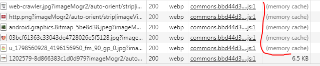
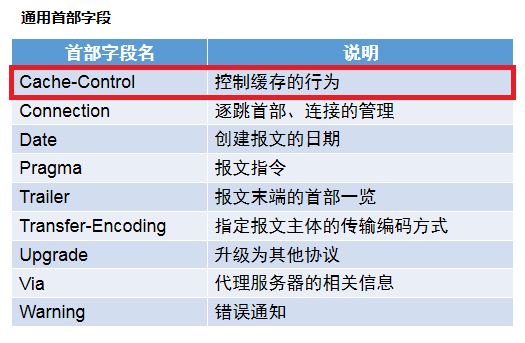
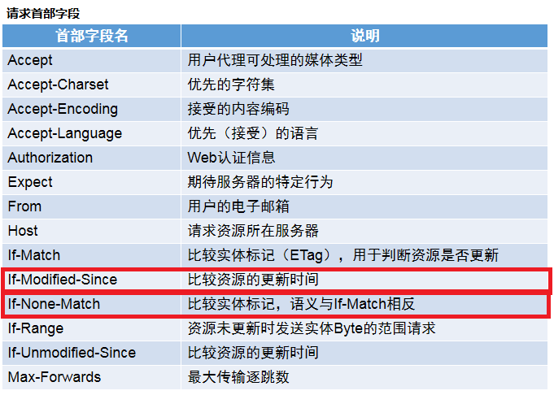
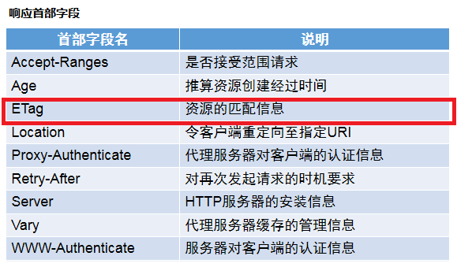
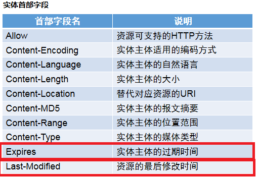
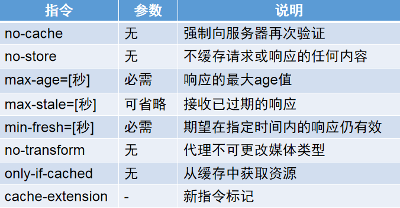
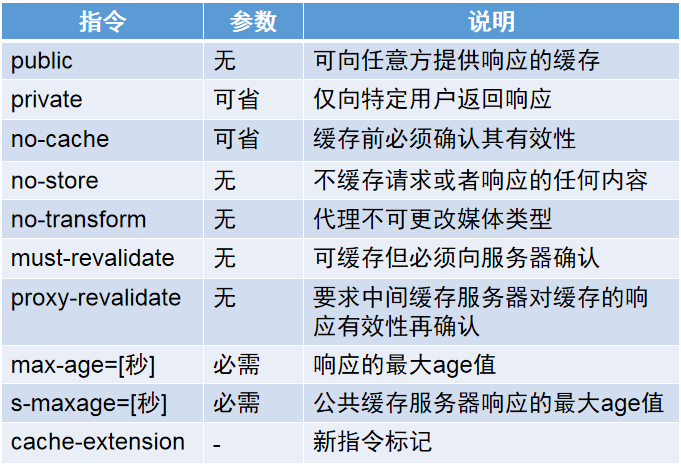
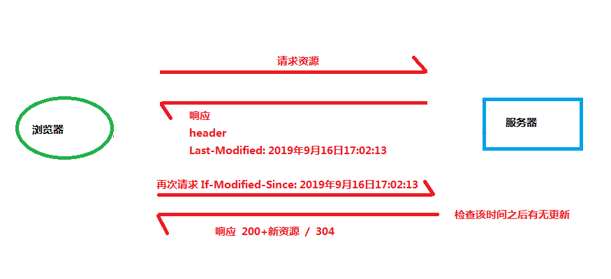

# 浏览器缓存

- 参考资料：
- 《图解HTTP》
- <https://mp.weixin.qq.com/s/tPZ2KxPZWGigAHbJliZLQA>
- <https://www.jianshu.com/p/54cc04190252>
- <https://www.jianshu.com/p/768be2733872>
- <https://www.cnblogs.com/ranzige/p/3952837.html>

## 宏观定位浏览器缓存

- 浏览器缓存是web缓存技术其中之一。

### web缓存

- web缓存：这是一种网站性能优化的技术。是指访问web网站时需要的web资源（比如html文件,js,css,图片等等），经过一次请求后被保存下来的资源副本。用于避免重复发出对相同资源的请求，减少带宽消耗，缓解服务器压力，提高用户访问网页的速度。
- web缓存技术有以下几种：
    1. 数据库缓存
    2. 服务器缓存
    3. 浏览器缓存
    4. web应用层缓存

- 这篇文章主要讨论的就是其中的浏览器缓存技术。

### 浏览器缓存工作的位置

- 在一个网站中最基础的动作就是发请求收数据，整个过程如下：

```bash
              发出请求
        -------------------->
浏览器                          服务器
        <--------------------
         处理请求整理出数据返回
```

- 浏览器缓存工作的位置就是在浏览器端。或者拥有缓存时不发送请求而直接访问缓存数据，或者发起请求但是经比对缓存与数据一致那就不需要接收数据而直接利用缓存。
- 加入缓存后整个过程放大如下：

```bash
                  发出请求
        ---------------------------->
             得到相应的缓存资源          浏览器缓存
        <----------------------------
浏览器   没有相应缓存，向服务器发出请求
        ---------------------------->
            处理请求，返回资源            服务器
        <----------------------------
```

## 浏览器缓存的实现

- 有以下四种实现的方法
  1. Service Worker
  2. Memory Cache
  3. Disk Cache
  4. Push Cache

### 1. Service Worker

- Service Worker是基于web worker的技术。web worker就是js里的多线程概念，主线程可创建work子线程并行执行任务。
- Service Worker利用web worker建立了独立的线程用于缓存工作，它会拦截网页上需要缓存资源网络请求，判断是否有匹配的缓存资源，有的话返回缓存，否则继续放出请求，然后新增缓存
- 生命周期：注册->安装->激活->拦截请求->暂停/废弃
- 我fork了一份官方demo，做了一个简单的注释/注释翻译，可以参考：<https://github.com/HEYAN123/samples/tree/gh-pages/service-worker/basic>

### 2. Memory Cache

- 内存缓存。打开页面时提前加载可能用到的资源，把请求到的资源放到内存上，快速读取。
- 当我们访问一个页面时可以看到很多资源都是从内存中读取到的：



- 启用这种缓存的方法常用如下：

  - 利用img或者object等标签预加载脚本（但不执行），然后动态插入脚本时就会直接从缓存中读取
  - 使用link标签的ref属性让浏览器对脚本的加载做特殊处理：

```html
<link rel="subresource" href="xxx">  预加载当前页面要访问的资源
<link rel="prefetch" href="xxx">  预加载将要访问的资源
<link rel="dns-prefetch" href="xxx">  提前解析dns并缓存域名信息
```

### 3. Disk Cache

- 硬盘缓存。即把我们需要常用的资源存储到本地硬盘上。我们常使用的方法就是利用localStorage。

### 4. Push Cache

- 推送缓存。是优先级最低的缓存。在HTTP/2标准中发布。意思是服务器主动将未来可能用到的资源推送给客户端提前缓存。
- 常见有两种方法开启：
  1. 通过标签（也可以通过js动态创建）
  2. 使用HTTP头部字段（这个头部在前面文章介绍中没有列举，因为之前列举的是http/1版本）

```html
<link rel="preload" href="xxx.css" as="style">
```

```bash
Link: <https://xxx.com/xxx.css>; rel=preload; as=style
```

## 浏览器缓存的策略

- 那么如何控制有缓存时候取缓存资源，没有缓存时候请求服务器呢？这时候就应该有一个好的缓存策略来指挥浏览器的行为，浏览器依据缓存策略来行动。通常浏览器的缓存策略有两种：
    1. 协商缓存
    2. 强缓存

- 这两种策略不是互相排斥的，我们会综合使用两种策略。回顾我们之前提到的请求过程：

```bash
                  发出请求
        ---------------------------->              强
             得到相应的缓存资源          浏览器缓存   缓
        <----------------------------              存
浏览器   没有相应缓存，向服务器发出请求               协
        ---------------------------->               商
            处理请求，返回资源            服务器      缓
        <----------------------------              存
```

- 具体策略通过HTTP请求头的相关字段来规定，常用如下所标：






### 强缓存

- 强缓存控制浏览器请求浏览器缓存资源。
- 激活此策略的字段有：

#### 1. Expires

- 通常出现在响应的实体字段中。指缓存的过期时间。
- 服务器返回此字段意味着之后该资源在过期日期之前一直取缓存资源就好，不必反复请求。

#### 2. Cache-Control

- 此字段属于通用首部。放在请求头中时表示缓存请求相关，放在响应头中表示对缓存的管理相关。
- 请求头中的Cache-Control：

- 响应头中的Cache-Control：


- 当Cache-Control有指定max-age指令时，此指令优先于Expires

### 协商缓存

- 当由于强缓存策略里设置的条件不满足而命中失败后，浏览器就会携带缓存标识向服务器发起请求，或者说确认——命中失败的原因由服务器分析缓存标识而得到，进而由服务器指示浏览器的下一步行动——这就是协商缓存：服务器返回304表示资源无更新，浏览器则从缓存中获取资源，返回200则从服务器上获得资源并新存入缓存。

- 通常协商缓存是为了再确认某个缓存资源是否可用。通过Last-Modified和ETag两字段实现。

#### Last-Modified和If-Modified-Since

- 是指最后的修改日期。浏览器请求资源服务器作出的响应实体头部会带有此字段。当下次再次请求时会在请求头中带上If-Modified-Since，该值等于上次响应头中的Last-Modified。服务器接收到请求后会检查从这个时间之后资源有没有更新，如果没有返回304，如果有则返回200和新的资源。



#### ETag和If-None-Match

- ETag和If-None-Match是Last-Modified和If-Modified-Since的替换方案
- 前面的表里提到ETag是资源的匹配信息，也就是一份资源的唯一标识，浏览器向服务器发出请求服务器返回资源时会带上此标识，当下一次请求来了时此标识会放在请求头的If-None-Match中供服务器检查是否有更新，有则返回200和新资源，否则304。
