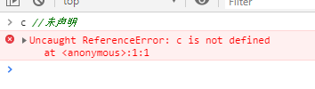
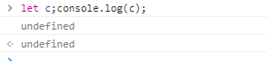
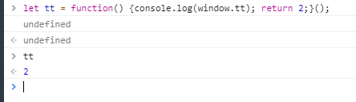

# Generator

## 前言

- 先看一下js中的未声明或未赋值的结果

- 未声明：



- 未赋值：



- 当执行一个表达式：var a = 12; 右侧未返回值时变量处于已声明未赋值状态。



## 接下来看生成器函数的使用

```javascript
function* gen() {
    console.log('before a');
    var that = this;
    let a = yield console.log('111', that.a); // 此处t.next(1);停止 未返回值，a没有被赋值
    console.log('a', a); // a的值由yield表达式返回的值决定，而这里【yield console.log('111')】返回的值由t.next(2)中的入参决定，就是2,此时a被赋值
    let b = yield console.log('222'); // t.next(2);停止
    console.log('b', b);
    let c = yield console.log('333'); // t.next(3);停止
    console.log('c', c);
    let d = yield console.log('444'); // t.next(4);停止
    console.log('d', d); // t.next(5);
}

let t = gen();
// 该函数不执行，返回一个指向内部状态的指针对象，也就是遍历器对象


t.next(1);
// 打印：before a 111 undefined
// 并且【next方法】返回一个对象：{value: undefined, done: false} 第一次调用next传递的参数无效
// 此时指针指到执行完第一个yield：yield console.log('111');
t.next(2);
// 打印：a 2 222
// 并且【next方法】返回一个对象：{value: undefined, done: false} 此处调用next传递的参数作为了上次yield表达式返回的值
t.next(3);
// 打印：b 3 333
// 并且【next方法】返回一个对象：{value: undefined, done: false} 此处调用next传递的参数作为了上次yield表达式返回的值
t.next(4);
// 打印：c 4 444
// 并且【next方法】返回一个对象：{value: undefined, done: false} 此处调用next传递的参数作为了上次yield表达式返回的值


t.next(5);
// 打印：d 5
// next返回{value: undefined, done: true} 这一步会直接进行到结尾
t.next(6);
// next返回{value: undefined, done: true}
t.next(7);
// next返回{value: undefined, done: true}

```